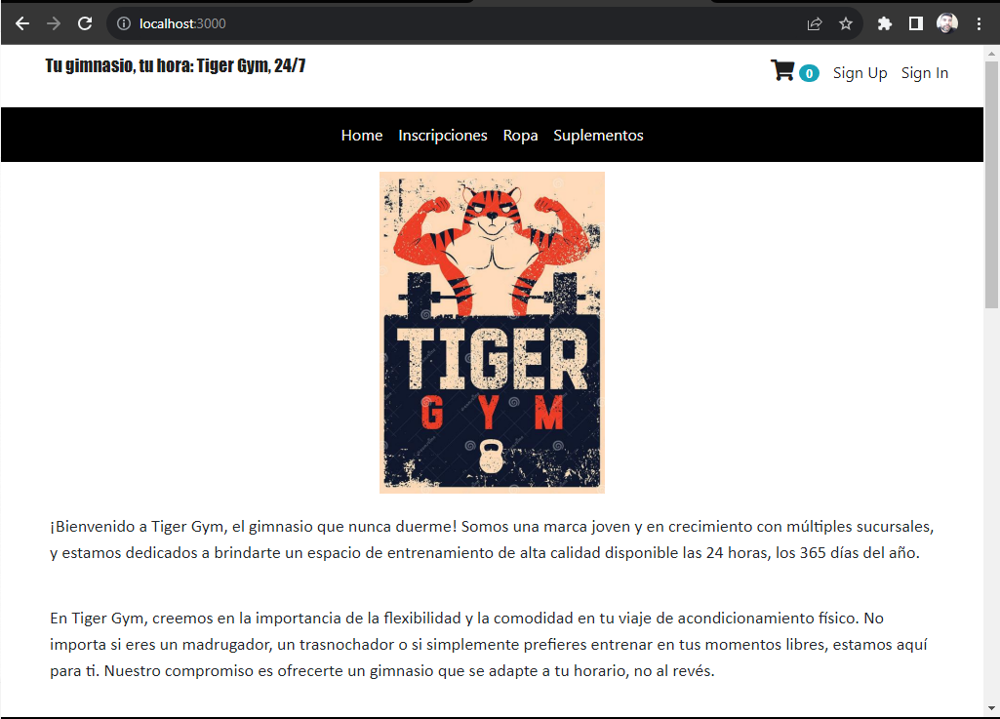
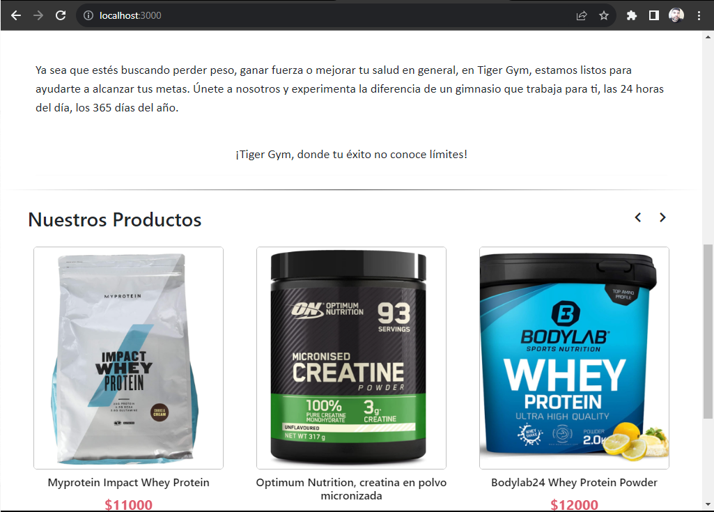
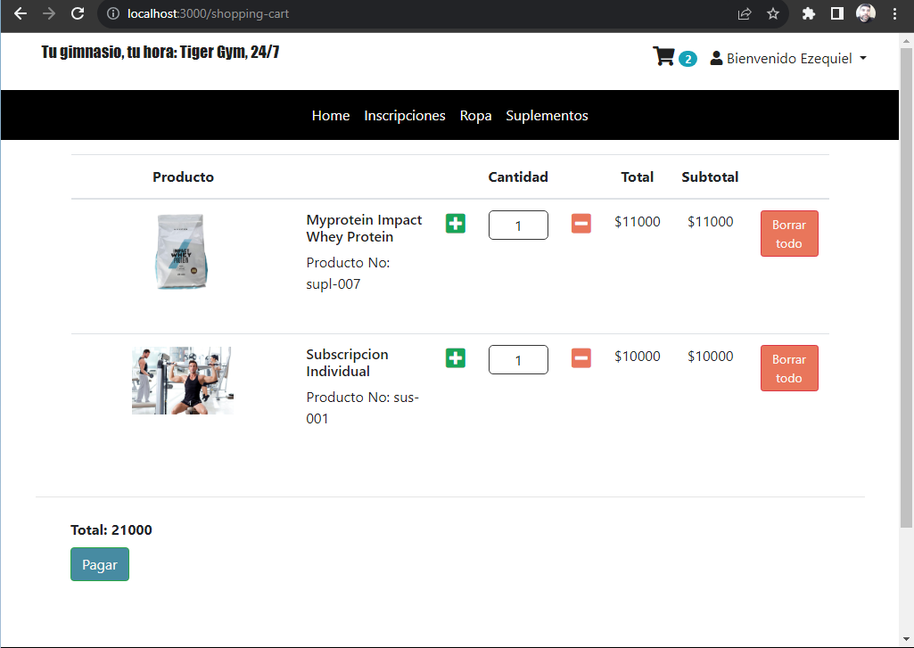

# Proyecto integrador: E-commerce Tiger GYM por el TEAM NOCHE
Proyecto integrador del 4 semestre  de la Tecnicatura en Programacion de la UTN FSRS

Profesor: Ariel Betancud

Integrantes del TEAM NOCHE:

• [Alvarenga, Analia](https://github.com/RastaLunaRL)  
• [Contreras, Yamila](https://github.com/Yami-Contreras)  
• [González, María Del Carmen](https://github.com/uninstallrar)  
• [Marchetti, Bruno](https://github.com/Br1marchetti)  
• [Marino, Alfredo](https://github.com/AlfredoMarino123)  
• [Pons Toloza, Florencia](https://github.com/FlorPons)  
• [Soria, Julio Ezequiel](https://github.com/kelo72)   
• [Soriano, Marlene](https://github.com/Marlenesoriano)  
• [Suarez, Carlos Hernan](https://github.com/Hernan-DOS)   
• [Videla, Franco](https://github.com/odin1301)

<a href="https://github.com/CodeSystem2022/E-commerce-4-semestre-Team-Noche/blob/main/img-readme/BRIEFING%20TEAM%20NOCHE.pdf"><h1>Brief del proyecto</h1></a>

<h2>Capturas</h2>

HOME

SLIDE de PRODUCTOS

CARRITO

